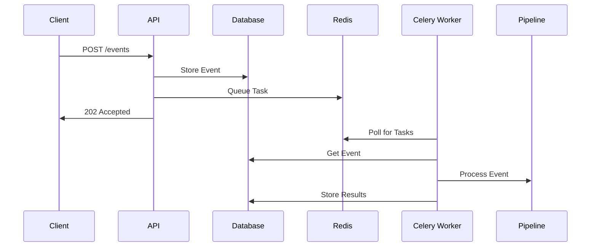

# Understanding the Repository Architecture

The Repository architecture represents a modern approach to creating AI-powered applications, combining event-driven design principles with production-grade infrastructure. At its core, it aims to solve a common problem in the AI development landscape: bridging the gap between experimental AI prototypes and production-ready systems.

## Introduction

Creating AI applications often starts with exciting proof-of-concept projects that demonstrate the potential of large language models like GPT-4 or Claude. However, transforming these prototypes into reliable, scalable applications requires significant infrastructure work – handling asynchronous processes, state management, error handling, and coordinating multiple services. This is where the Repository comes into play.

The architecture follows a clear separation of concerns, organizing the system into distinct layers, each serving a specific purpose. When a request comes in, it flows through these layers in a predictable order: from the API layer through event processing, queues, and storage, with seamlessly integrated AI services.

What makes this architecture particularly powerful is its foundation on time-tested technologies. The system is built on [FastAPI](https://fastapi.tiangolo.com/) for high-performance API handling, [PostgreSQL](https://www.postgresql.org/) with [pgvector](https://github.com/pgvector/pgvector) for reliable data and vector storage, [Redis](https://redis.io/) and [Celery](https://docs.celeryq.dev/) for robust task processing, and modern AI providers like OpenAI and Anthropic for language model capabilities.

## System Flow and Components

When a client application interacts with the Repository, it initiates a carefully orchestrated flow through several architectural layers. Let's trace this path to understand how each component contributes to system reliability.

### Request Path

Every interaction begins at the API level, where FastAPI handles incoming HTTP requests. Instead of processing these requests synchronously, the system converts them into events – a design decision that ensures resilience and scalability. Each request is validated against predefined event schemas, ensuring data consistency before it enters the core system.

The event handler serves as the system's traffic controller. It performs two critical tasks: storing the event in PostgreSQL for audit and recovery, and placing it in a Redis queue for asynchronous processing. This dual-write approach ensures that no request is lost, even if parts of the system experience temporary failures.

### Asynchronous Processing

The queue system, built on Redis and Celery, forms the foundation of our asynchronous processing capabilities. Celery workers continuously monitor queues, picking up events and routing them through appropriate processing pipelines. This architecture enables horizontal scaling – simply add more workers as processing demands increase.

Each pipeline consists of modular nodes that can be assembled like building blocks. A typical pipeline might include:

- Data transformation nodes
- Business logic nodes
- Routing nodes for conditional processing
- LLM nodes for AI-powered operations

### AI Integration Layer

The AI services layer is particularly sophisticated, including the LLM Factory, which abstracts the complexities of working with various AI providers. The Prompt Manager maintains versioned prompts, ensuring consistent AI interactions across the system. Whether you're using OpenAI GPT models, Anthropic Claude, or local models, the interface remains the same.

### Vector Storage and Search

For applications requiring semantic search or similarity matching, the storage layer includes PostgreSQL with the pgvector extension. This provides efficient storage and retrieval of high-dimensional vectors, essential for modern AI applications. The vector store is seamlessly integrated with the event processing pipeline, allowing real-time vector index updates.

### Error Handling and Resilience

The system is designed with failure in mind. Each component includes robust error handling:

- Failed events are automatically retried with exponential backoff
- Dead letter queues capture problematic events for later analysis
- Database transactions ensure data consistency
- Circuit breakers prevent cascading failures when external services are unavailable

## Extensibility and Customization

While the Repository provides a complete foundation, it's designed for extensibility. The Pipeline Registry allows registering custom processing nodes, and the LLM Factory can be extended to support new AI providers. The event-driven architecture means you can add new capabilities without changing existing code.

## Monitoring and Observability

The architecture includes comprehensive monitoring points throughout the pipeline. Each event is tracked from receipt to completion, with timing and status information stored in PostgreSQL. This enables detailed system performance analysis and helps identify bottlenecks or issues before they impact users.

## Deployment Features

The system is containerized using Docker, making it deployable in any container-supporting environment. The included Caddy server handles SSL/TLS termination and acts as a reverse proxy, simplifying deployment behind corporate firewalls or in cloud environments. 