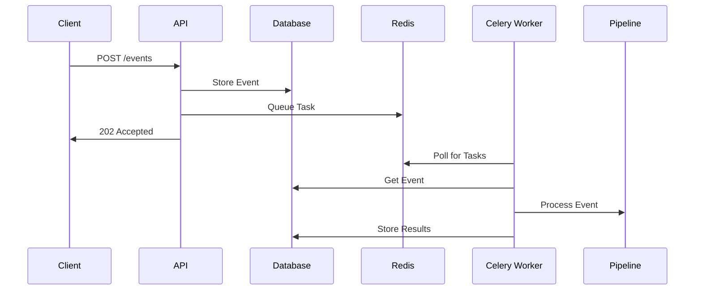

# Понимание архитектуры Репозитория

Архитектура Репозитория представляет собой современный подход к созданию AI-powered приложений, объединяя принципы event-driven дизайна с production-grade инфраструктурой. В своей основе она призвана решить распространенную проблему в ландшафте разработки AI: преодоление разрыва между экспериментальными AI прототипами и production-ready системами.

## Введение

Создание AI приложений часто начинается с увлекательных proof-of-concept проектов, демонстрирующих потенциал больших языковых моделей, таких как GPT-4 или Claude. Однако превращение этих прототипов в надежные, масштабируемые приложения требует значительной инфраструктурной работы – обработки асинхронных процессов, управления состоянием, обработки сбоев и координации множества сервисов. Именно здесь вступает в игру Репозиторий.

Архитектура следует четкому разделению задач, организуя систему в отдельные слои, каждый из которых служит определенной цели. Когда запрос поступает, он проходит через эти слои в предсказуемом порядке: от API слоя через обработку событий, очереди и хранение, с бесшовно интегрированными AI сервисами.

Что делает эту архитектуру особенно мощной – это её основа на проверенных временем технологиях. Система построена на [FastAPI](https://fastapi.tiangolo.com/) для высокопроизводительной обработки API, [PostgreSQL](https://www.postgresql.org/) с [pgvector](https://github.com/pgvector/pgvector) для надежного хранения данных и векторов, [Redis](https://redis.io/) и [Celery](https://docs.celeryq.dev/) для надежной обработки задач, и современных AI провайдерах, таких как OpenAI и Anthropic для возможностей языковых моделей.

## Системный поток и компоненты

Когда клиентское приложение взаимодействует с Репозиторием, оно инициирует тщательно организованный поток через несколько архитектурных слоев. Давайте проследим этот путь, чтобы понять, как каждый компонент способствует надежности системы.

### Путь запроса

Каждое взаимодействие начинается на уровне API, где FastAPI обрабатывает входящие HTTP запросы. Вместо синхронной обработки этих запросов, система преобразует их в события – проектное решение, которое обеспечивает устойчивость и масштабируемость. Каждый запрос проверяется на соответствие предопределенным схемам событий, обеспечивая согласованность данных перед их поступлением в ядро системы.

Обработчик событий служит системным контроллером трафика. Он выполняет две критические задачи: сохранение события в PostgreSQL для аудита и восстановления, и помещение его в очередь Redis для асинхронной обработки. Такой подход с двойной записью гарантирует, что ни один запрос не будет потерян, даже если части системы испытывают временные сбои.

### Асинхронная обработка

Система очередей, построенная на Redis и Celery, формирует основу наших возможностей асинхронной обработки. Celery workers постоянно отслеживают очереди, забирая события и направляя их через соответствующие pipeline'ы обработки. Такая архитектура позволяет горизонтальное масштабирование – просто добавьте больше workers, когда возрастают требования к обработке.

Каждый pipeline состоит из модульных узлов, которые можно собирать как конструктор. Типичный pipeline может включать:

- Узлы преобразования данных
- Узлы бизнес-логики
- Узлы маршрутизации для условной обработки
- LLM узлы для AI-powered операций

### Слой интеграции AI

Слой AI сервисов особенно сложен, включая LLM Factory, который абстрагирует сложности работы с различными AI провайдерами. Prompt Manager поддерживает версионированные промпты, обеспечивая согласованное взаимодействие с AI по всей системе. Независимо от того, используете ли вы модели OpenAI GPT, Anthropic Claude или локальные модели, интерфейс остается неизменным.

### Векторное хранение и поиск

Для приложений, требующих семантического поиска или сопоставления по схожести, слой хранения включает PostgreSQL с расширением pgvector. Это обеспечивает эффективное хранение и поиск высокоразмерных векторов, что необходимо для современных AI приложений. Векторное хранилище бесшовно интегрировано с pipeline'ом обработки событий, позволяя обновлять векторный индекс в реальном времени.

### Обработка ошибок и устойчивость

Система спроектирована с учетом возможных сбоев. Каждый компонент включает надежную обработку ошибок:

- Неудачные события автоматически повторяются с экспоненциальной задержкой
- Очереди недоставленных сообщений захватывают проблемные события для последующего анализа
- Транзакции базы данных обеспечивают согласованность данных
- Предохранители предотвращают каскадные сбои при недоступности внешних сервисов

## Расширяемость и настройка

Хотя Репозиторий предоставляет полную основу, он спроектирован для расширяемости. Pipeline Registry позволяет регистрировать пользовательские узлы обработки, а LLM Factory может быть расширен для поддержки новых AI провайдеров. Event-driven архитектура означает, что вы можете добавлять новые возможности без изменения существующего кода.

## Мониторинг и наблюдаемость

Архитектура включает комплексные точки мониторинга по всему pipeline'у. Каждое событие отслеживается от приема до завершения, с информацией о времени и статусе, хранящейся в PostgreSQL. Это позволяет проводить детальный анализ производительности системы и помогает выявлять узкие места или проблемы до того, как они повлияют на пользователей.

## Особенности развертывания

Система контейнеризирована с использованием Docker, что делает её развертываемой в любой среде, поддерживающей контейнеры. Включенный Caddy сервер обрабатывает SSL/TLS терминацию и действует как reverse proxy, упрощая развертывание за корпоративными файерволами или в облачных средах.