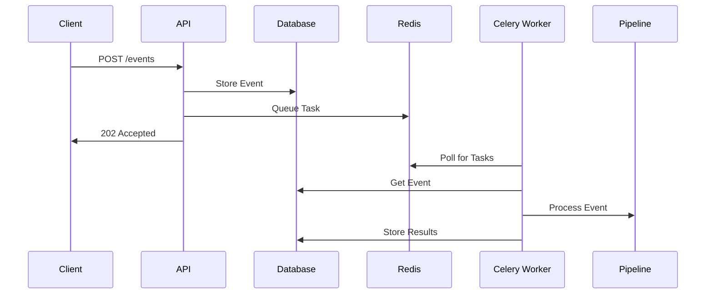

# Система Worker'ов

Репозиторий использует Celery для асинхронной обработки задач, реализуя надежный pipeline обработки событий, который разделяет обработку API запросов и фактическое выполнение задач.

## Обзор архитектуры

Система worker'ов состоит из трех основных компонентов:

1. **API Endpoint**: Принимает и валидирует запросы
2. **Redis Queue**: Управляет очередью задач
3. **Celery Worker**: Асинхронно обрабатывает задачи


## Celery

Celery - это система распределенных очередей задач с открытым исходным кодом, которая позволяет выполнять длительные Python функции в фоновом режиме как асинхронные задачи. Она позволяет вашему приложению выполнять сложные вычисления или обрабатывать большие нагрузки без блокировки основного потока выполнения, тем самым улучшая производительность и пользовательский опыт.

При использовании совместно с Redis, хранилищем структур данных в памяти, используемым в качестве брокера сообщений, Celery может эффективно управлять и распределять задачи между несколькими worker'ами или машинами.

### Как Celery работает с Redis

1. Определение задачи: Вы определяете задачи в вашем приложении, используя декоратор @celery.task. Эти задачи являются обычными Python функциями, которые вы хотите выполнять асинхронно.
2. Вызов задачи: Когда вашему приложению нужно выполнить задачу, оно отправляет сообщение в очередь задач Celery вместо немедленного выполнения функции.
3. Брокер сообщений (Redis): Redis действует как посредник, который хранит сообщения задач. Он ставит задачи в очередь и обеспечивает их доставку worker'ам.
4. Worker'ы: Worker'ы Celery - это процессы, которые прослушивают очередь Redis. Они забирают задачи, выполняют их и могут сохранять результаты при необходимости.
5. Backend результатов (Опционально): Если вам нужно получить результаты задачи, Celery может хранить их, используя Redis или другой backend, чтобы ваше приложение могло получить к ним доступ позже.

### Преимущества

- Асинхронное выполнение: Выгрузка длительных задач в фоновый режим, сохраняя отзывчивость основного приложения.
- Масштабируемость: Легкое добавление дополнительных worker'ов для обработки возросшей нагрузки без изменения кода приложения.
- Надежность: Задачи хранятся в Redis до их успешного выполнения, обеспечивая отсутствие потерь задач.
- Планирование: Поддержка выполнения задач в определенное время или с определенными интервалами.

## Реализация потока задач

### 1. API Endpoint (endpoint.py)

API endpoint реализует неблокирующий паттерн:

```python
@router.post("/")
def handle_event(
    data: EventSchema,
    session: Session = Depends(db_session),
) -> Response:
    # Store event in database
    repository = GenericRepository(session=session, model=Event)
    event = Event(data=data.model_dump(mode="json"))
    repository.create(obj=event)

    # Queue task for processing
    task_id = celery_app.send_task(
        "process_incoming_event",
        args=[str(event.id)],
    )

    return Response(
        status_code=HTTPStatus.ACCEPTED,
        content=json.dumps({
            "message": f"process_incoming_event started `{task_id}`"
        })
    )
```

Это обеспечивает:

- Мгновенный ответ клиентам
- Постоянное хранение событий
- Асинхронную обработку
- Возможность отслеживания задач

### 2. Конфигурация Celery (celery_config.py)

Celery настроен для работы с Redis в качестве брокера сообщений:

```python
def get_redis_url():
    redis_host = f"{os.getenv('PROJECT_NAME')}_redis"
    return f"redis://{redis_host}:6379/0"

@lru_cache
def get_celery_config():
    redis_url = get_redis_url()
    return {
        "broker_url": redis_url,
        "result_backend": redis_url,
        "task_serializer": "json",
        "accept_content": ["json"],
        "result_serializer": "json",
        "enable_utc": True,
        "broker_connection_retry_on_startup": True,
    }

celery_app = Celery("tasks")
celery_app.config_from_object(get_celery_config())
```

Ключевые особенности:

- Redis в качестве брокера и хранилища результатов
- JSON сериализация для задач и результатов
- Автоматическое обнаружение задач
- Повторное подключение при запуске

### 3. Обработка задач (tasks.py)

Worker обрабатывает задачи через четко определенный жизненный цикл:

```python
@celery_app.task(name="process_incoming_event")
def process_incoming_event(event_id: str):
    with contextmanager(db_session)() as session:
        # Get event from database
        repository = GenericRepository(session=session, model=Event)
        db_event = repository.get(id=event_id)
        
        # Convert to schema and process
        event = EventSchema(**db_event.data)
        pipeline = PipelineRegistry.get_pipeline(event)
        
        # Add Elasticsearch indexing to pipeline
        pipeline.add_node(ElasticsearchIndexNode())
        
        # Execute pipeline and store results
        task_context = pipeline.run(event).model_dump(mode="json")
        db_event.task_context = task_context
        repository.update(obj=db_event)
```
Эта реализация:

- Получает данные события из базы данных
- Определяет подходящий pipeline
- Выполняет pipeline обработки
- Сохраняет результаты обратно в базу данных