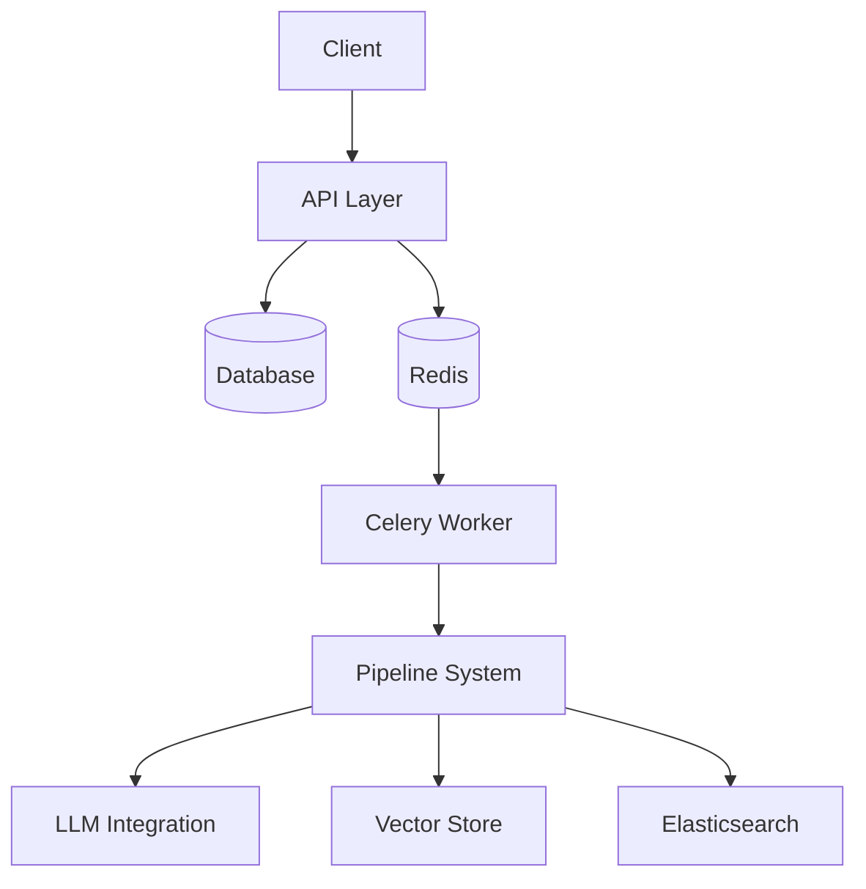
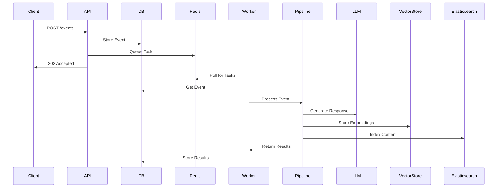
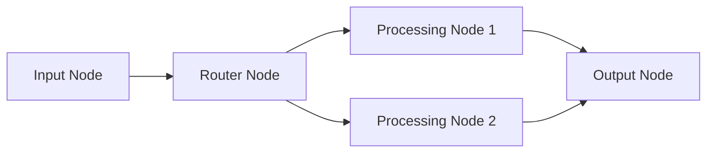
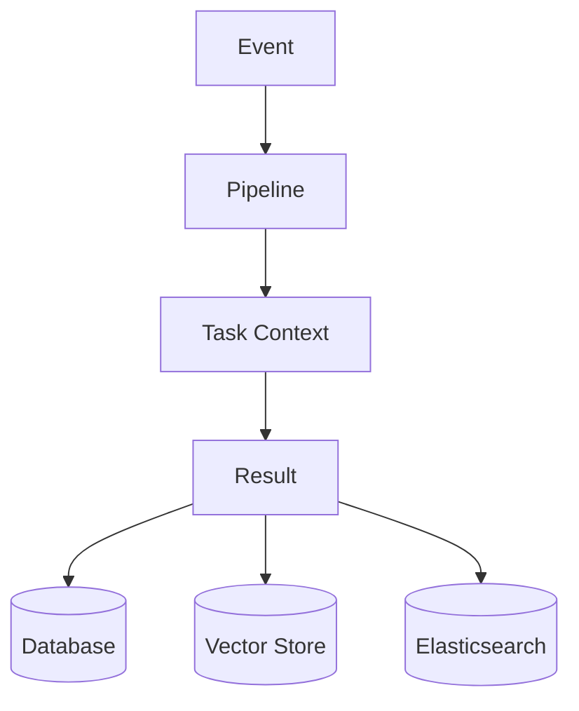
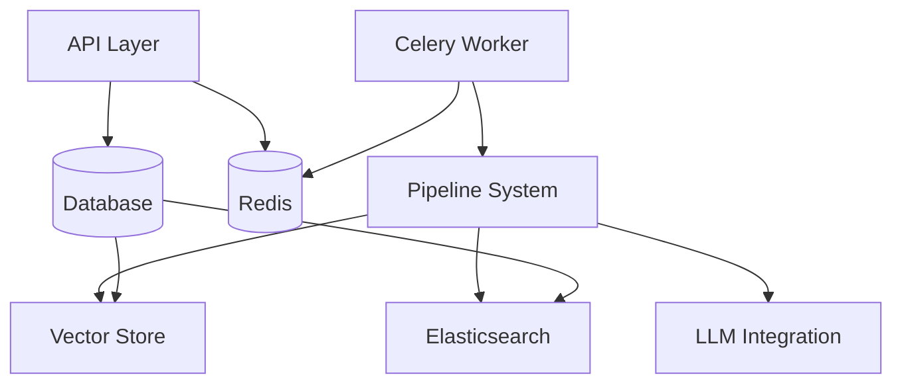
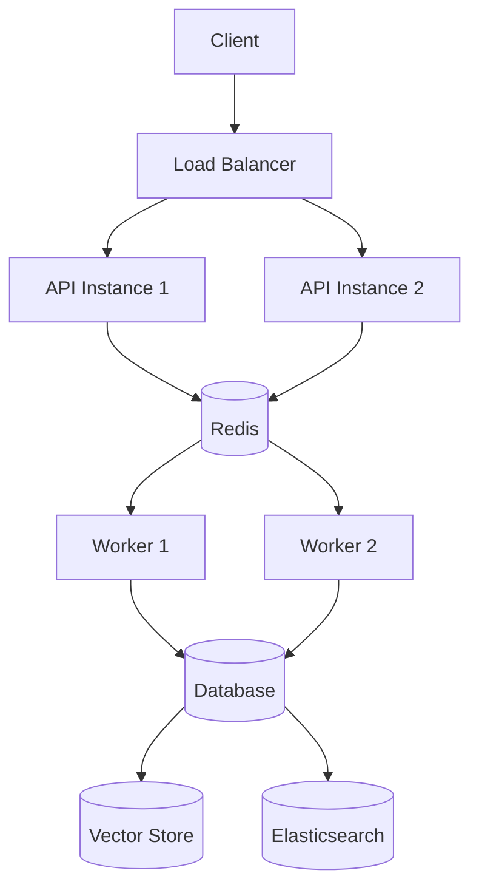

# System Architecture Diagrams

This document provides a comprehensive overview of the system architecture through various diagrams.

## System Components

## Event Flow

## Pipeline Architecture

## Data Flow

## Component Dependencies

## Deployment Architecture

