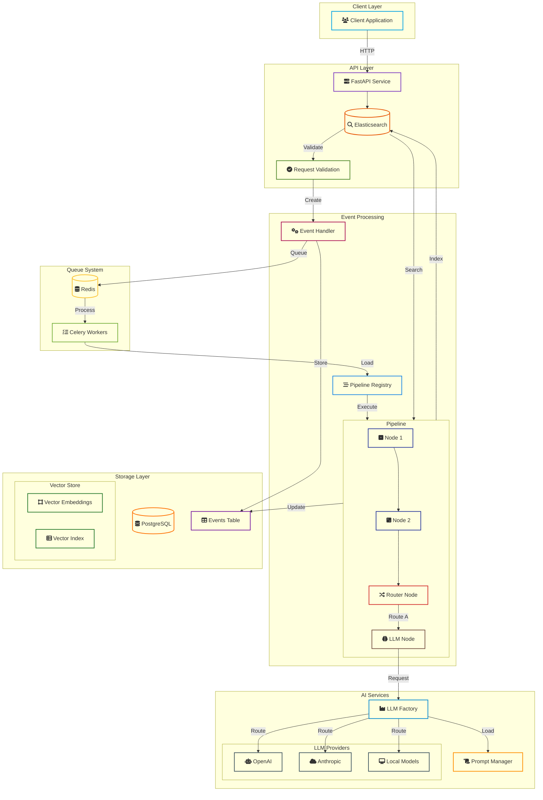

```mermaid
graph TB
    %% Nodes with icons and enhanced styling
    subgraph Client Layer
        Client["fa:fa-users Client Application"]:::clientStyle
    end

    subgraph API Layer
        API["fa:fa-server FastAPI Service"]:::apiStyle
        VAL["fa:fa-check-circle Request Validation"]:::validationStyle
        ES["fa:fa-file-code Event Schema"]:::schemaStyle
    end

    subgraph Event Processing
        EH["fa:fa-cogs Event Handler"]:::handlerStyle
        PR["fa:fa-stream Pipeline Registry"]:::pipelineStyle
        subgraph Pipeline
            PN1["fa:fa-dice-one Node 1"]:::pipelineNode
            PN2["fa:fa-dice-two Node 2"]:::pipelineNode
            PN3["fa:fa-random Router Node"]:::routerStyle
            PN4["fa:fa-brain LLM Node"]:::llmNode
            PN1 --> PN2
            PN2 --> PN3
            PN3 -->|Route A| PN4
        end
    end

    subgraph Queue System
        RD[("fa:fa-database Redis")]:::queueStyle
        CW["fa:fa-tasks Celery Workers"]:::workerStyle
    end

    subgraph Storage Layer
        PG[("fa:fa-database PostgreSQL")]:::storageStyle
        ES[("fa:fa-search Elasticsearch")]:::searchStyle
        subgraph Vector Store
            VE["fa:fa-vector-square Vector Embeddings"]:::vectorStyle
            VI["fa:fa-th-list Vector Index"]:::vectorStyle
        end
        ET["fa:fa-table Events Table"]:::tableStyle
    end

    subgraph AI Services
        LF["fa:fa-industry LLM Factory"]:::llmFactoryStyle
        PM["fa:fa-scroll Prompt Manager"]:::managerStyle
        subgraph LLM Providers
            OAI["fa:fa-robot OpenAI"]:::providerStyle
            ANT["fa:fa-cloud Anthropic"]:::providerStyle
            LMA["fa:fa-desktop Local Models"]:::providerStyle
        end
    end

    %% Connections
    Client -->|HTTP| API
    API --> ES
    ES -->|Validate| VAL
    VAL -->|Create| EH
    EH -->|Store| ET
    EH -->|Queue| RD
    RD -->|Process| CW      
    CW -->|Load| PR
    PR -->|Execute| Pipeline
    PN4 -->|Request| LF
    LF -->|Load| PM
    LF -->|Route| OAI & ANT & LMA
    Pipeline -->|Update| ET
    Pipeline -->|Index| ES
    ES -->|Search| Pipeline

    %% Styles
    classDef clientStyle fill: transparent, stroke: #00A1E4, stroke-width: 2px;
    classDef apiStyle fill:transparent,stroke:#7D3AC1,stroke-width:2px;
    classDef validationStyle fill:transparent,stroke:#558B2F,stroke-width:2px;
    classDef schemaStyle fill:transparent,stroke:#FFB300,stroke-width:2px;
    classDef handlerStyle fill:transparent,stroke:#AD1457,stroke-width:2px;
    classDef pipelineStyle fill:transparent,stroke:#1E88E5,stroke-width:2px;
    classDef pipelineNode fill:transparent,stroke:#303F9F,stroke-width:2px;
    classDef routerStyle fill:transparent,stroke:#D32F2F,stroke-width:2px;
    classDef llmNode fill:transparent,stroke:#795548,stroke-width:2px;
    classDef queueStyle fill:transparent,stroke:#FBC02D,stroke-width:2px;
    classDef workerStyle fill:transparent,stroke:#7CB342,stroke-width:2px;
    classDef storageStyle fill:transparent,stroke:#FF6F00,stroke-width:2px;
    classDef vectorStyle fill:transparent,stroke:#2E7D32,stroke-width:2px;
    classDef tableStyle fill:transparent,stroke:#7B1FA2,stroke-width:2px;
    classDef llmFactoryStyle fill:transparent,stroke:#0288D1,stroke-width:2px;
    classDef managerStyle fill:transparent,stroke:#FF8F00,stroke-width:2px;
    classDef providerStyle fill:transparent,stroke:#455A64,stroke-width:2px;
    classDef searchStyle fill:transparent,stroke:#E65100,stroke-width:2px;
```
